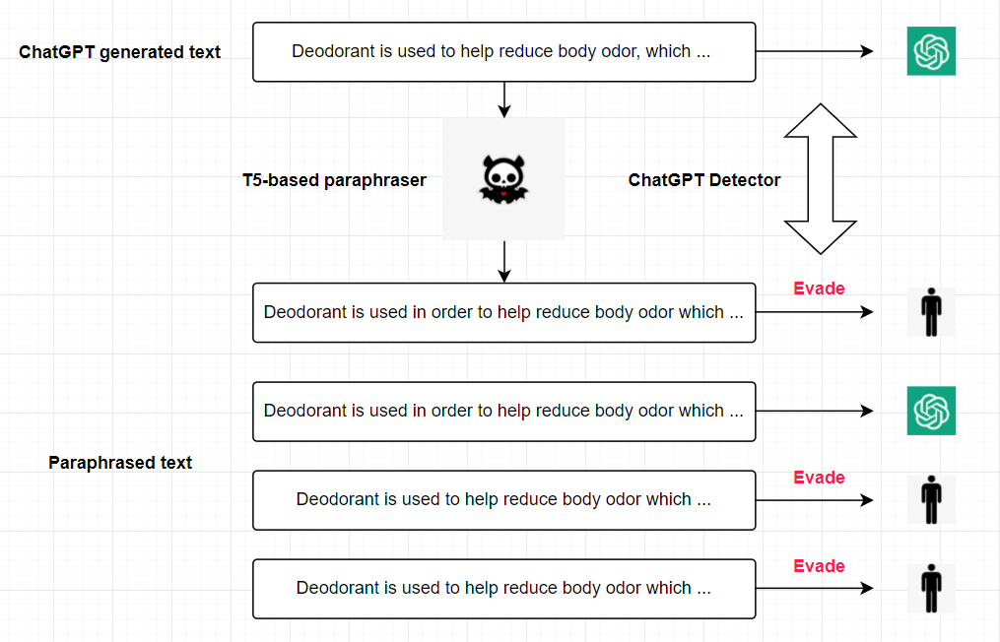
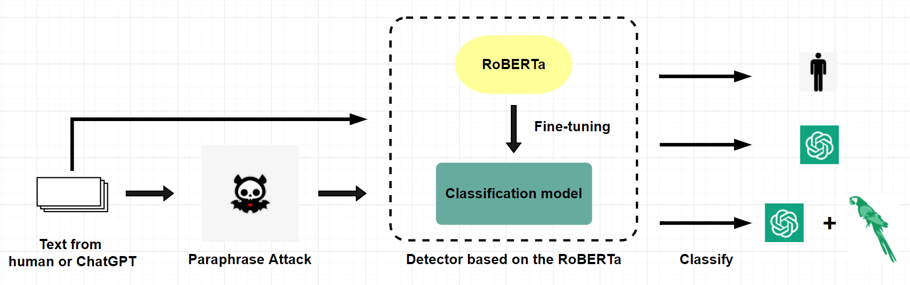

# Defending Against Paraphrasing Attacks with RoBERTa-Based Model

# Abstract
The increasing prevalence of language models like ChatGPT has raised concerns
about the creation of fake content and plagiarism. Detecting whether a text is
generated by ChatGPT is becoming more challenging and significant. Various
detection algorithms have been proposed, but recent studies have shown that
paraphrasing attacks, which means generating restated text without substantially
changing the meaning, can significantly reduce the accuracy of detectors. This
paper investigates the vulnerability of ChatGPT Detector to three paraphrasing
attacks and identified factors contributing to decreased accuracy. In the end, we
propose three-classification detectors based on RoBERTa that can successfully
defend against them. Our results confirm that fine-tuning a RoBERTa-based
detector using paraphrased data leads to improved accuracy and robustness in
detecting paraphrases.

# Introduction

OpenAI released ChatGPT on November 30, 2022. This powerful language model has the ability
to engage in dialogue by comprehending and learning human language and context. While this
technology has brought convenience, it has also raised concerns, particularly with regards to creating
fake content and plagiarism. Stokel-Walker has highlighted its potential use in undergraduate
education such as essay writing, assignment solving, code creation, and assessments.

This paper presents an investigation of the vulnerability of ChatGPT Detector to three paraphrasing
attacks: Parrot, PEGASUS, ChatGPT-T5-based paraphraser. We begin by reproducing ChatGPT
Detector and subsequently subjecting it to these paraphrasing attacks. We then analyze the reasons
behind the decrease in the accuracy of detectors and propose more practical detectors based on
RoBerta that can successfully defend against these three paraphrasing attacks.

# Motivation
Recent studies have shown that paraphrasing attacks, which means generating restated text without substantially changing the meaning, can significantly reduce the accuracy of detectors.

**Paraphrasing Attacks**
<center>    <br/> </center>

# Model Architecture
**Architecture**
1. Use paraphrase attack on the ChatGPT generated texts.
2. Put all the texts into the RoBERTa-based detector.
3. Detector Classifies the text into three categories: human, ChatGPT, and ChatGPT+Paraphrase.

<center>    <br/> </center>


# Reproduce ChatGPT Detector
## Task Definition

Given a dataset of text samples, the goal is to build a detector that can classify each sample as either human-written or AI-generated. The detector will be trained using a pre-trained language model, such as BERT or Roberta.

The whole process will involve the following steps:

Data preparation: The text samples in the dataset will be preprocessed, including tokenization and normalization, to prepare them for input to the pre-trained language model.

Fine-tuning the pre-trained language model: The pre-trained language model will be fine-tuned on text classification, using a labeled dataset of human-written and AI-generated text. The fine-tuning process will involve adjusting the parameters of the pre-trained language model to improve its ability to classify text as human-written or AI-generated.

Evaluation: The fine-tuned language model will be evaluated on a holdout dataset to measure its accuracy, precision, recall, and F1 score in detecting AI-generated text.

Testing: Finally, the fine-tuned language model will be used to classify new text samples as human-written or AI-generated.

By formulating the detection task as a text classification problem and fine-tuning a pre-trained language model on this task, we can build a detector that is capable of accurately detecting AI-generated text.
 
## DataSet
Our dataset is sourced from HC3-English. 

Since there was no publicly available dataset split mentioned in the paper, we have divided the dataset into a typical 80% training set and 20% test set, with 10% of the training set reserved for validation set. 

The preprocessing step is shown in preprocess.py. 

You just need to download the [all.jsonl](https://huggingface.co/datasets/Hello-SimpleAI/HC3/blob/main/all.jsonl) into ./dataset from [HC3-English](https://huggingface.co/datasets/Hello-SimpleAI/HC3/tree/main).

## Baseline

In this project, we reproduce the detector following [ChatGPT detector](https://huggingface.co/spaces/Hello-SimpleAI/chatgpt-detector-single), which is an open-source detector for ChatGPT.

We provided the modified code in this project for training and testing detector model.

You can follow the guideline to reproduce it.

## Guideline

The detector is a Roberta for classification model with labels (0: human, 1:ChatGPT).

If you want to train it, follow these steps:

1. install the environment

```bash
pip install -r requirements.txt
```

One thing you have to pay attention to is you should install the proper version of the torch according to your machine. 

2. prepare the data

Download the all.jsonl into ./dataset

Split the data into train set, validate set and test set:

```bash
python preprocess.py
```

3. train
```bash
python train.py
```

Please read the code in this file carefully if you want to know how to train and test the model in detail.

4. get the detector

The ```best_model.pt``` is the trained detector.

You can test the custom sample in text_test.txt (only three examples in it):

```bash
python test.py
```
